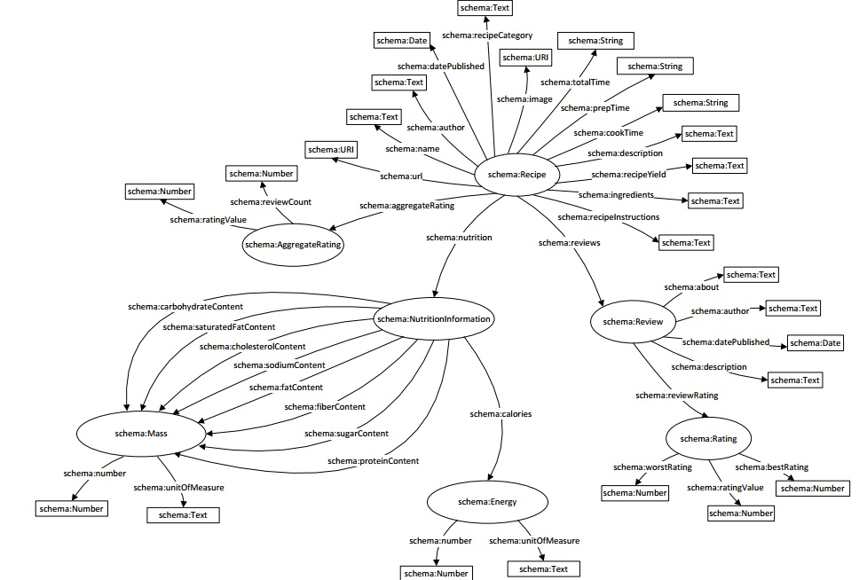

# 1. Opis problema

Predmet ovog rada je izrada aplikacije koja vrši ekstrakciju strukturiranih podataka o receptima i čuva ih u RDF bazu. Recepti se nalaze na web stranici za pretragu recepata [Food.com](http://food.com). Svaki recept sa ovog web sajta opisan je pomoću meta podataka koji su umetnuti u sam HTML stranice, a sami meta podaci su definisani pomoću [Microdata](http://en.wikipedia.org/wiki/Microdata_(HTML))
standarda. Ekstrahovane podatke je zatim potrebno sačuvati u RDF repozitorijumu i omogućiti da im se pristupa putem REST servisa.

Osnovni zahtevi u izradi ove aplikacije su:

- kreiranje web crawlera koji prikuplja stranice sa sajta Food.com,
- analiziranje strukture web stranice recepta kako bi se ekstrahovali umetnuti Microdata podaci o receptu,
- kreiranje RDF baze i čuvanje ekstrahovanih podataka o receptu u skladu sa [schema.org](http://schema.org/) RDF vokabularom,
- omogućavanje pristupa podacima u bazi pomoću odgovarajućih REST servisa.

# 2. Domenski model

U skladu sa RDF vokabularom [Recipe](http://schema.org/Recipe), kreiran je domenski model, predstavljen sledećim dijagramom:

Slika 1 - Domenski model

Klasa *Recipe* sadrži osnovne podatke o receptu. Ona poseduje podatke o adresi recepta, nazivu, autoru, datumu objavljivanja,
kategorijama kojima taj recept pripada, slikama jela, vremenu kuvanja, vremenu pripreme, ukupnom vremenu,opisu recepta,
neophodnim sastojcima i njihovim količinama, detaljnim uputstvima o spremanju, kao i količini porcije koja se dobija receptom.

Klasa *NutritionInformation* sadrži podatke o nutritivnim informacijama datog recepta, konkretno o količini ugljenih hidrata,
zasićenih masti, holesterola, natrijuma, vlakana, masti, šećera, proteina i kalorija. Količina kalorija iskazuje se
pomoću klase *Energy*, dok se sve ostale nutritivne informacije izražavaju pomoću klase *Mass*.

Klasa *Review* predstavlja komentar korisnika na određeni recept. Tu se pamte podaci o temi komentara, autoru, datumu objavljivanja i opisu, odnosno samom tekstu komentara. Prilikom davanja kometara, korisnik daje i ocenu samog recepta, koja se predstavlja klasom *Rating*. Ona sadrži podake o najmanjoj i najvećoj mogućoj oceni, kao i o oceni koju je dao autor komentara.

Klasa *AggregateRating* sadrži podatke o trenutnoj oceni recepta, tako što vodi računa o broju komentara i prosečnoj oceni svih komentara.

# 3. Rešenje

Kreirana je aplikacija koja prikuplja meta podatke o receptima predstavljenim preko Microdata standarda sa web sajta
[Food.com](http://food.com). Na osnovu tih podataka kreira odgovarajuće objekte domenskog modela, a zatim te objekte
čuva u lokalnu RDF bazu. Aplikacija dalje omogućava pristup sačuvanim podacima pomoću RESTful servisa.

Aplikacija pruža tri REST servisa:

* **GET /api/recipes** - vraća podatke o receptima. Opcioni parametri su:
  * *name* – reč u nazivu recepta
  * *author* – reč u nazivu autora recepta
  * *recipeCategory* – kategorije recepta
  * *hasImage* – samo recepti sa slikom
    (moguće vrednosti: yes)
  * *totalTime* – ukupno vreme spremanja (priprema i kuvanje)
    (moguće vrednosti: 15min and less, 30min and less, 1h and less, 2h and less, 3h and less, 4h and less)
  * *prepTime* – ukupno vreme pripreme
    (moguće vrednosti: 15min and less, 30min and less, 1h and less, 2h and less, 3h and less, 4h and less)
  * *cookTime* – ukupno vreme kuvanja
    (moguće vrednosti: 15min and less, 30min and less, 1h and less, 2h and less, 3h and less, 4h and less)
  * *ingredients* – glavni sastojci u jelu
  * *minAggregateRatingValue* – minimalna ocena koju bi recept trebalo da ima
  * *minCarbs* – minimalna količina ugljenih hidrata (g)
  * *maxCarbs* – maksimalna količina ugljnih hidrata (g)
  * *minSatFat* – minimalna količina zasićenih masti (g)
  * *maxSatFat* – maksimalna količina zasićenih masti (g)
  * *minCholesterol* – minimalna količina holesterola (mg)
  * *maxCholesterol* – maksimalna količina holesterola (mg)
  * *minSodium* – minimalna količina natrijuma (mg)
  * *maxSodium* – maksimalna količina natrijuma (mg)
  * *minFat* – minimalna količina masti (g)
  * *maxFat* – maksimalna količina masti (g)
  * *minFiber* – minimalna količina vlakana (g)
  * *maxFiber* – maksimalna količina vlakana (g)
  * *minSugar* – minimalna količina šećera (g)
  * *maxSugar* – maksimalna količina šećera (g)
  * *minProtein* – minimalna količina proteina (g)
  * *maxProtein* – maksimalna količina protein (g)
  * *minCalories* – minimalna količina kalorija (cal)
  * *maxCalories* – maksimalna količina kalorija (cal)
  
  Primer poziva ovog servisa:

  > GET/recipes?name=chili&recipeCategory=american&hasImage=yes&ingredients=jalapeno,honey
  
* **GET /api/recipes/id** - vraća podatke o jednom receptu sa zadatim id-jem.
  
  Primer poziva ovog servisa:

  > GET/recipes/0517b1e2-e3b3-48b0-8f2f-23af6dc9f646
  
* **GET /api/recipes/id/reviews** - vraća komentare recepta sa zadatim id-jem.
  
  Primer poziva ovog servisa:

  > GET/recipes/0517b1e2-e3b3-48b0-8f2f-23af6dc9f646/reviews

# 4. Tehnička realizacija

Aplikacija je rađena u Javi.

Za analiziranje web stranica i prikupljanje podataka sa njih korišćena je [Jsoup](http://jsoup.org/) biblioteka. 
U pitanju je biblioteka koja omogućava parsiranje HTML stranica pomoću pogodnog API-a za ekstrakciju podataka,
kao i pretragu i manipulaciju podacima. Ona obezbeđuje pristup željenim DOM elementima.

U aplikaciji je korišćena i [Jenabean](https://code.google.com/p/jenabean/) biblioteka, pomoću koje je omogućeno jednostavno
mapiranje Java objekata u RDF putem anotacija. Biblioteka pruža mogućnost da se Java klase kreiraju na klasičan način, a zatim
se dodavanjem odgovarajućih anotacija definiše način na koji će se one mapirati u RDF klase.

[Jena TDB](http://jena.apache.org/documentation/tdb/) je komponeneta Jena framework-a. Koristi se za obezbeđivanje
perzistencije RDF podataka, tj. njihovo skladištenje. Jena TDB takođe podržava i izvršavanje SPARQL upita nad sačuvanim
podacima.

Obezbeđivanje i rad sa RESTful servisima implementiran je pomoću [Jersey](https://jersey.java.net/) framework-a, koji
olakšava kreiranje web servisa u Javi. Web servisi se kreiraju putem anotacija, kojima se definiše vrsta HTTP zahteva
na koju taj servis odgovara kao i putanja do odgovarajućeg resursa.
